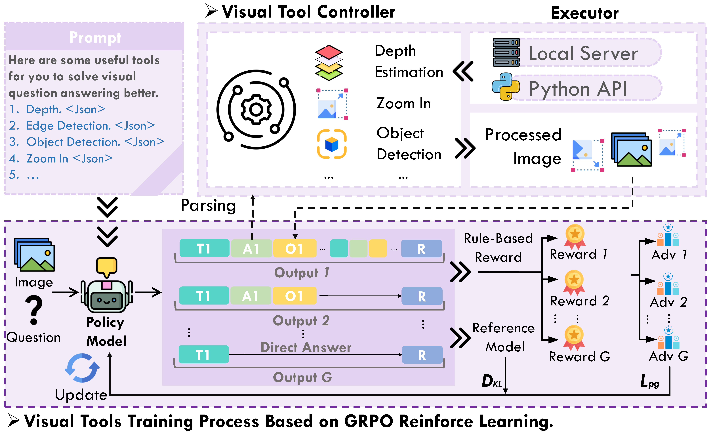

<h1 align="center">Reinforced Visual Perception with Tools</h1>

<p align="center">
<strong><a href="https://arxiv.org/abs/2509.01656">📃Paper<a> | <a href="https://huggingface.co/collections/Frywind/revpt-68b05161d2426128ea5db4d3">🤗Models & Datasets Repo</a></strong>
</p>

This repository contains the official implementation for the paper **"Reinforced Visual Perception with Tools"**.

Our work introduces **REVPT**, a novel framework designed to enhance the visual perception capabilities of multimodal large language models (MLLMs) through reinforcement learning (RL). **ReVPT** trains models to effectively reason about and utilize external visual tools, such as object detection, zoom-in, edge detection, and depth estimation, to solve complex visual perception tasks.



## Installation
```bash
conda create -n revpt python=3.10 -y
conda activate revpt
pip install torch==2.6.0 torchvision==0.21.0
pip install https://github.com/Dao-AILab/flash-attention/releases/download/v2.7.4.post1/flash_attn-2.7.4.post1+cu12torch2.6cxx11abiFALSE-cp310-cp310-linux_x86_64.whl
pip install -e ".[vllm]"

conda create -n tools python=3.10 -y
conda activate tools
pip install torch==2.4.1 torchvision==0.19.1
pip install https://github.com/Dao-AILab/flash-attention/releases/download/v2.7.4.post1/flash_attn-2.7.4.post1+cu12torch2.4cxx11abiFALSE-cp310-cp310-linux_x86_64.whl
pip install transformers==4.42.0 fastapi uvicorn matplotlib opencv-python python-multipart
```

## Tool services

change config in `tools/tools_config_2.json`
```bash
cd Depth-Anything-V2
mkdir checkpoints
wget https://huggingface.co/depth-anything/Depth-Anything-V2-Large/resolve/main/depth_anything_v2_vitl.pth?download=true

python tools/lanuch_tools.py --config tools_config_2.json
```

## Train
You can download data from [here](https://huggingface.co/datasets/Frywind/REVPT-data). Put them under `data`.

Generate data using the following command:
```bash
python data/sat_jsonl.py --local-dir [LOCAL_DIR]
```

Change config in `scripts/run.sh`
```bash
bash scripts/run.sh
```

## Eval
You can download data from [here](https://huggingface.co/datasets/Frywind/REVPT-data). Put them under `data`.

Datasets and prompts can be found in `eval/agent_eval.py`. You can deploy vllm servers:
```bash
bash scripts/deploy.sh [MODEL_PATH] [MODEL_NAME] [CUDA_DEVICES] [STARTING_PORT]
```
Then run eval:
```bash
cd eval
python agent_eval.py --model-name [MODEL_NAME] --port-pool [PORT_POOL] --workers [WORKERS] --dataset [DATASET] --prompt [PROMPT] --evaluate
```
The parameter 'evaluate' will use regex to extract answer in \boxed{} to compare with ground truth answer.

You can use `benchmark.sh` to run all datasets

## Citation
```bibtex
@misc{zhou2025reinforcedvisualperceptiontools,
      title={Reinforced Visual Perception with Tools}, 
      author={Zetong Zhou and Dongping Chen and Zixian Ma and Zhihan Hu and Mingyang Fu and Sinan Wang and Yao Wan and Zhou Zhao and Ranjay Krishna},
      year={2025},
      eprint={2509.01656},
      archivePrefix={arXiv},
      primaryClass={cs.CV},
      url={https://arxiv.org/abs/2509.01656}, 
}
```
